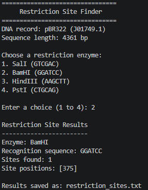

# Restriction Site Finder

Restriction Site Finder is a beginner-friendly Python program that searches a
DNA sequence for the recognition site of a selected restriction enzyme.

This is the fourth project in my bioinformatics portfolio. It applies basic
sequence searching to a practical molecular-biology example.

## Project objective

> Which recognition sites for common restriction enzymes are present in the
> pBR322 plasmid sequence?

## Features

- Reads a DNA sequence from a FASTA file
- Offers four common restriction enzymes
- Finds every occurrence of the selected recognition sequence
- Reports positions using 1-based biological numbering
- Saves the results in a plain-text report
- Uses only basic Python and the standard library

## Dataset

The project uses the complete pBR322 cloning-vector sequence from NCBI
GenBank, accession [J01749.1](https://www.ncbi.nlm.nih.gov/nuccore/J01749.1).

## Enzymes

| Enzyme | Recognition sequence |
|---|---|
| SalI | `GTCGAC` |
| BamHI | `GGATCC` |
| HindIII | `AAGCTT` |
| PstI | `CTGCAG` |

Recognition sequences were checked against the New England Biolabs
[restriction-enzyme reference](https://www.neb.com/en-us/tools-and-resources/selection-charts/alphabetized-list-of-recognition-specificities).

## Repository contents

```text
bioinformatics-project-03-restriction-site-finder/
|-- restriction_site_finder.py
|-- pbr322.fasta
|-- restriction_sites.txt
|-- images/
|   `-- project_output.png
|-- requirements.txt
|-- LICENSE
|-- .gitignore
`-- README.md
```

## How to run

1. Open the repository folder in Visual Studio Code.
2. Open `restriction_site_finder.py`.
3. Select **Run Python File**.
4. Enter a number from 1 to 4 to choose an enzyme.

You can also run:

```powershell
python restriction_site_finder.py
```

## Output

The program displays the enzyme, recognition sequence, number of matching
sites, and their positions. It also creates `restriction_sites.txt`.

Example using BamHI:

```text
Restriction Site Results
------------------------
Enzyme: BamHI
Recognition sequence: GGATCC
Sites found: 1
Site positions: [375]

Results saved as: restriction_sites.txt
```

The screenshot below shows the program successfully analyzing the pBR322
sequence for the BamHI recognition site.



## Verified results

| Enzyme | Site position |
|---|---:|
| SalI | 651 |
| BamHI | 375 |
| HindIII | 29 |
| PstI | 3607 |

The program and all four site searches were checked with Python 3.14.

## Limitations

- The program searches for recognition sequences but does not simulate DNA cutting.
- It does not calculate fragment sizes or create a plasmid map.
- It treats the FASTA sequence as a simple text sequence and does not search across the circular-sequence boundary.

These limits keep the project focused on basic and explainable Python.

## License

This project is available under the MIT License.
